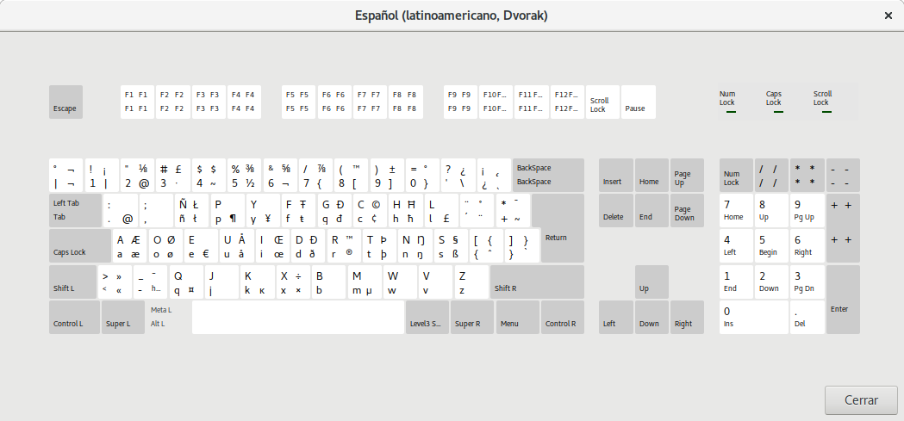

Dvorak Latin America variant for MS Windows
=====================================

This is a Latin American variant of Dvorak keyboard layout for the Windows operating system. It is the same variant that is bundled with Fedora Linux 23+.

You can install it from the zip provided in this repo or build it from the source file using [Microsoft Keyboard Layout Creator](https://msdn.microsoft.com/en-us/globalization/keyboardlayouts).

It has been tested with Windows 10.

-----------------------------------------------------

Esta es una variante latinoamericana de la distribución de teclado para el sistema operativo Windows. Se trata de la misma variante que se entrega con Fedora Linux 23+.

Puedes instalarla directamente desde el zip publicado en este repositorio o compilarla tú mismo desde el archivo fuente con la herramienta [Microsoft Keyboard Layout Creator](https://msdn.microsoft.com/en-us/globalization/keyboardlayouts).

Se ha probado que funciona en Windows 10.

-----------------------------------------------------

